# Crank handle

**Build status:** Built and tested.

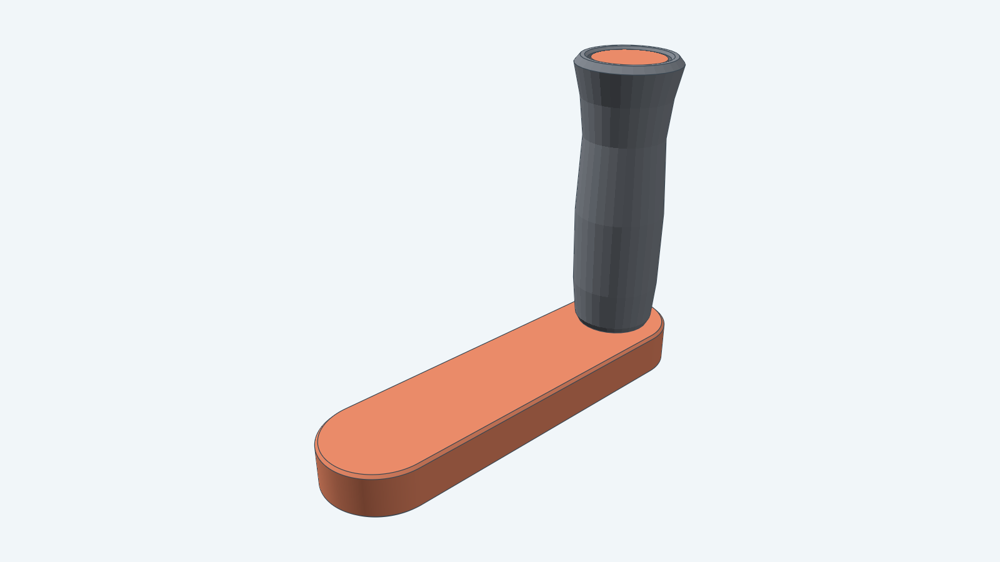

A printed hand crank for a D-flat shaft. It is the crank of the [hand-crank siren](../handcranksiren/), which builds
its crank from this model. The arm pinches the shaft: a slit runs through its hub into the bore, and two M2 bolts across
the hub close the slit on the shaft. A pin is clamped into the arm's far end by another M2 bolt and nut, and the handle
turns freely on the pin, so your hand does not twist on it as you crank. The pin's head holds the handle on.

The pin prints as two halves cut lengthwise, each lying flat on the bed, so its layers run along the pin and the hand's
force bends it along the printed lines instead of pulling its layers apart. Two small M2 bolts across the pin clamp the
halves together.

The crank fits a shaft that runs in a purchased bearing, because the shaft's diameter equals the bearing's bore. The
default fits the 5 mm shaft of a 605ZZ bearing. A second preset fits the 8 mm shaft of a 608-2RS (or 608ZZ) bearing; it
is the siren's crank. The shaft is part of the mechanism the crank drives and is not in this model.

**Clearance adjustment:** Mixed. The bore's clearance is a parameter; the bolts and nuts keep their nominal size.

## Views

From the side, the handle stands on the arm's far end.

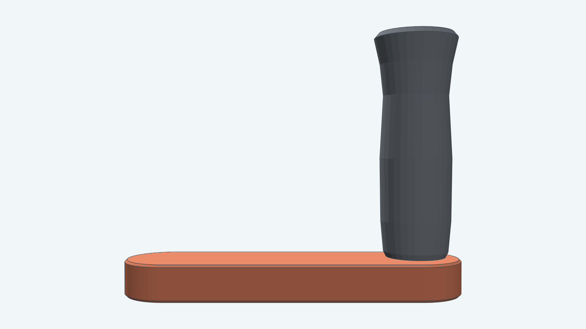

From below, the arm's back face shows the D bore with the slit running from it to the arm's end, and the pin bolt's
head, flush in its pocket. This face goes against the mechanism.

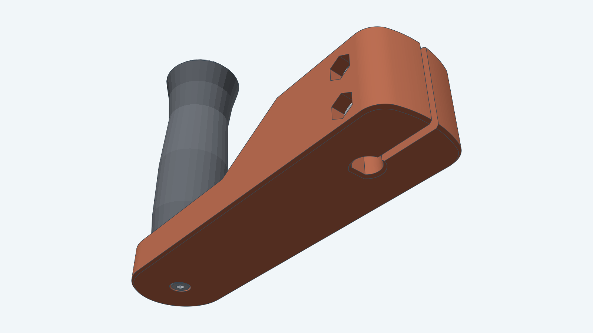

## The clamp

The arm keeps its full 20 mm width past the shaft. Its sides run straight on, turn into 4.5 mm corners, and close with
one shallow 22 mm end arc, every join smooth, so the hub has no inside corner and no step. The end reaches 13.9 mm
behind the shaft's axis on the 605ZZ crank and 15.4 mm on the 608-2RS crank.

Under the bore the hub is a boss 17 mm long, so the arm grips the shaft over 15.75 mm. The boss rises from the arm's
outer face and joins the 8 mm arm through a 30° ramp, so it needs no support when printed. The 608-2RS crank's bore has
two opposite flats, and the siren's crank shaft carries the matching second flat.

The cut runs along the clamp bolts. A 1.5 mm slit runs from the arm's end into the bore, the whole length of the hub,
and ends in a full round in the bore's floor. Two M2 x 16 bolts cross the arm, one 4 mm above the back face and one 4 mm
below the bore's floor. Each head sits flush in a pocket in one side face, and each bolt runs across the slit into a nut
in a hexagonal pocket in the other side face. The pocket is 4 mm deep, so the bolt's tip ends in it, 2 mm inside that
face. Tightening the bolts closes the slit and pinches the bore on the shaft.

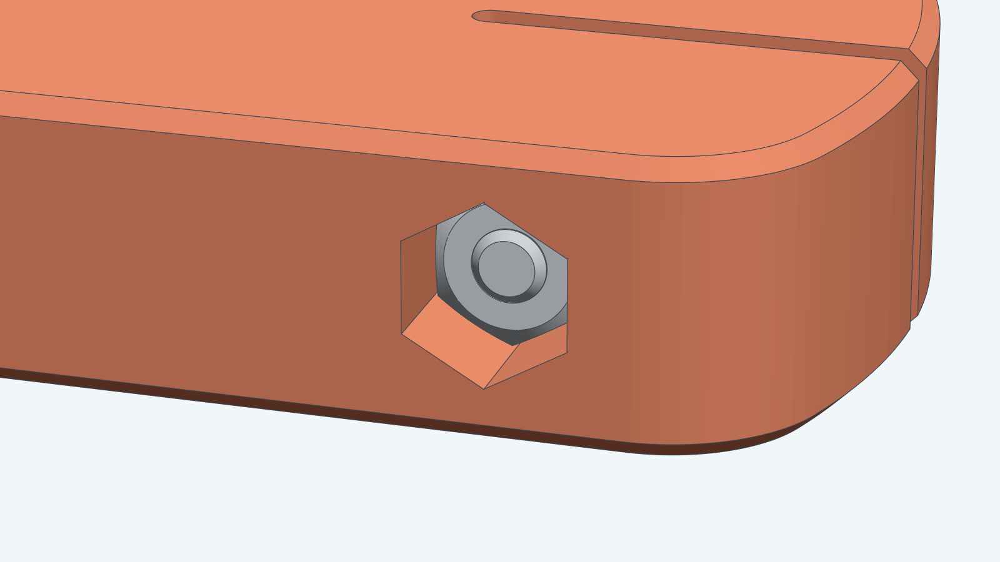

Each nut's pocket is a hexagon 4.35 mm across its flats and 4 mm deep, open to the side face. The nut sits at its floor. Its flats stop the nut
turning, so you tighten the bolt from the head's side alone, and the tightened bolt holds the nut in. The nut ends
below the face. One of the hexagon's diagonals runs along Z: a corner points up and one down, and the flats are its
two sides. The pocket's roof is two short slopes that meet in the upper corner, each 30° above horizontal, so they
print as a bridge and the arm needs no supports and no pause.

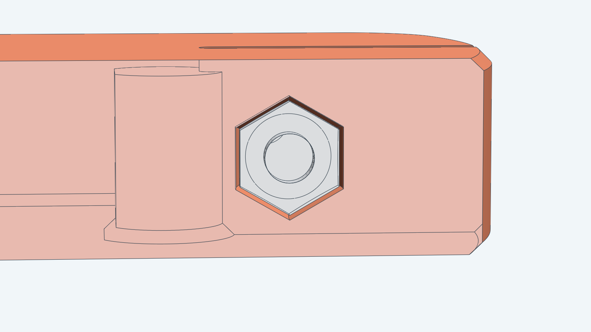

### How much it holds

The clamp is estimated to hold about 2.4 N.m (between 1.4 and 3.2), three times the old single-bolt, single-flat hub and
near the 3 N.m design torque. It does not reach a 4.5 N.m margin: the 8 mm printed shaft limits it, not the hub.
[instructions.md](instructions.md) ("Clamp capacity") shows the estimate. A bench test settles it: lock the shaft stub,
tighten both bolts and hang masses from the handle. 3 N.m is 5.6 kg at the 55 mm throw. Record the mass at slip or twist
and which part gave.

The clamp keeps listed exceptions to the gallery's rules ([instructions.md](instructions.md), "Retained sharp
corners and edges"):

- The slit's outline in the back face and in the boss top stays sharp. The slit is the working 1.5 mm clamp gap, and a 0.5 mm chamfer would
  open its mouth to 2.5 mm.
- The arm between the 605ZZ bore and the clamp bolts' holes is 1.05 mm, under the 1.6 mm wall a press-fit bore asks
  for. The slit makes the hub a clamp, so no pressed ring is loaded there. The 608-2RS web is 1.80 mm.
- Each clamp bolt's head pocket keeps a sharp floor rim. The 0.3 mm head clearance leaves no room to round it.
- Each nut pocket keeps its six hexagon corners sharp, to match the nut's sharp corners.
- A pocket's floor round (0.6 mm) is cut at a slant by the layers, which read it as a turn over 45°.
- The ramp's foot, a concave edge, and the ramp's two edges with the side faces stay sharp.

## How the parts go together

The picture cuts the crank through the shaft axis and the pin axis.

- The bore is blind: 1 mm of hub closes it at the boss top, and the shaft's end stops there. The bore is 0.05 mm larger
  than the shaft all round, a press fit, and the clamp bolts pinch it on the shaft, so the arm turns with the shaft.
  You can raise that clearance up to 0.5 mm.
- The pin's hexagonal stub sits in a hexagonal pocket in the arm with 0.25 mm of clearance on each flat, so the pin
  cannot turn in the arm. An M2 x 10 bolt from the arm's back face runs into a nut held inside the stub and holds the
  pin in the arm.
- Two M2 x 6 bolts cross the pin, one near each end of the handle. Each head sits flush on a small flat on one half,
  and each bolt runs into a nut in a hex pocket open to the other half's outer flat, so the bolts clamp the halves
  together.
- The handle's bore is 0.4 mm larger than the pin's shank all round, and the handle stands 0.4 mm clear of the arm and of
  the pin's head, so it turns freely. The head is wider than the handle's bore, so the handle cannot come off.

## Exploded

From the bottom: the M2 x 10 bolt, the arm with the two M2 x 16 clamp bolts pulled out of one side and the clamp nuts out
of their pockets in the other, the pin bolt's nut, the handle, and the pin with its two cross bolts on one side and their
nuts on the other.

## The split pin

The pin's two halves meet on the plane through the pin's axis that lies across the arm, the direction your hand pushes
the handle. That push then loads the two halves side by side, and they do not slide on each other.

- One half carries the cross bolts' head pockets. The other holds their nuts in hex pockets open to its outer flat,
  and each bolt holds its nut there.
- Each nut pocket's corners point across the pin and its flats lie along the pin's axis. That leaves 0.73 mm of pin
  between a corner and the shank's round at the flat, under the 1 mm the gallery asks for. The corners along the axis
  would keep 1.07 mm. [instructions.md](instructions.md) lists this as an exception to confirm.
- The M2 x 10 bolt that holds the pin in the arm runs along the seam. Its hole and its nut's pocket are split between
  the halves, and the clamped halves hold the nut in.

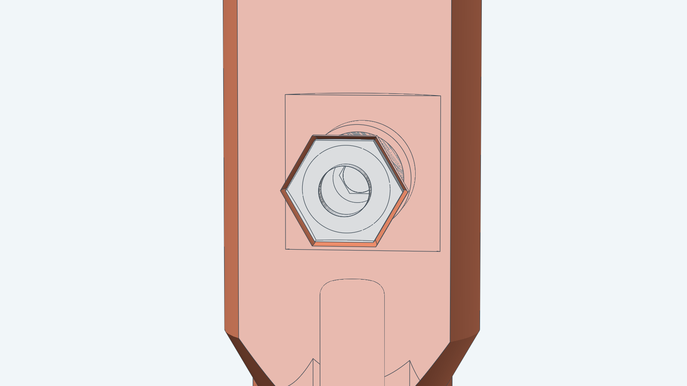

Each half prints lying on its cut face, with no supports.

## Parts

| Image | Name |
| --- | --- |
|  | Arm (printed) |
| 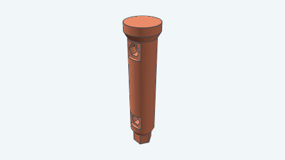 | Pin, assembled from its two halves |
| 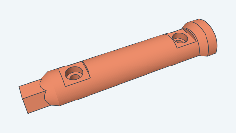 | Pin half with the cross bolts' head pockets (printed) |
|  | Pin half with the cross bolts' nut pockets (printed) |
|  | Handle (printed) |
| 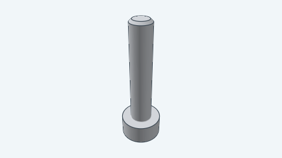 | M2 × 10 socket head cap screw ([`models/m2bolt`](../m2bolt)), 1 |
|  | M2 × 6 socket head cap screw ([`models/m2bolt`](../m2bolt)), 2 |
| 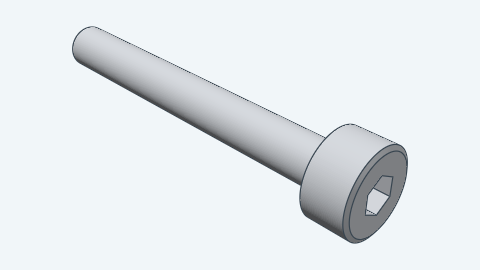 | M2 × 16 socket head cap screw ([`models/m2bolt`](../m2bolt)), 2, the clamp bolts |
| 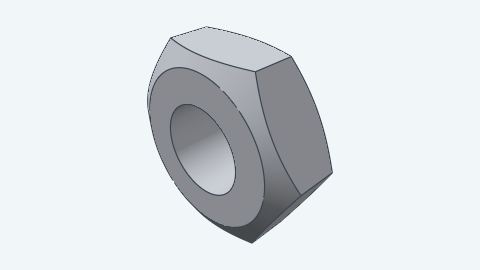 | M2 hex nut ([`models/m2nut`](../m2nut)), 5 |

## Sizes

The 605ZZ crank (left) and the 608-2RS crank (right). They differ in the bore and in how far the clamp's end reaches
behind the shaft.

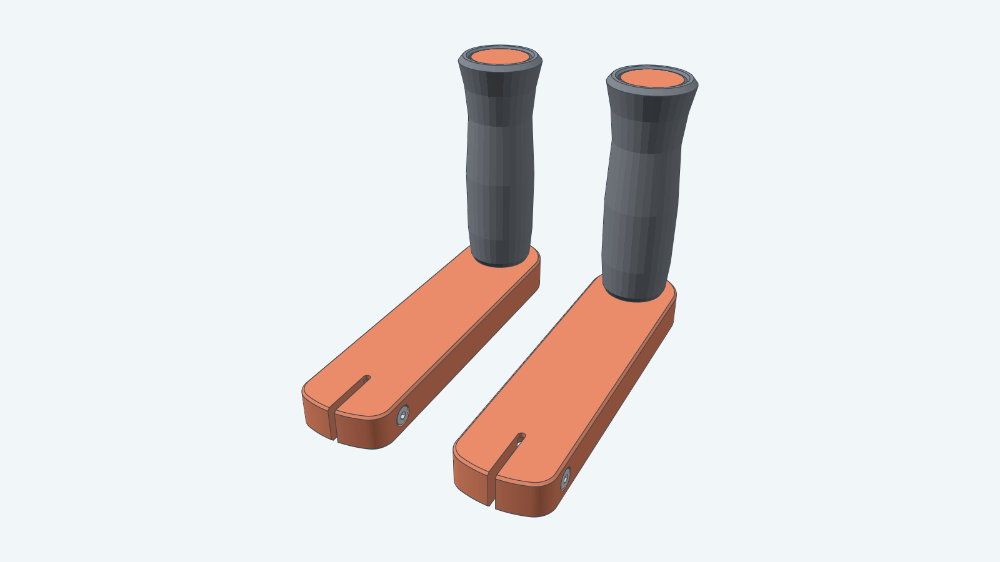

## Parameters

All dimensions are in millimeters. `Params.Validate` rejects a value outside its limit with an error that names it.

| Parameter | 605ZZ (default) | 608-2RS | Limit |
| --- | --- | --- | --- |
| `ShaftDiameter` | 5 | 8 | Above 0; leaves a 1.6 mm wall in the 20 mm arm (at most 16.7) |
| `FlatDepth` | 0.5 | 0.75 | Above 0 and at most a quarter of `ShaftDiameter` |
| `BoreClearance` | 0.05 | 0.05 | 0.05 to 0.5 |
| `Throw` | 55 | 55 | At least 35.29 |
| `DoubleFlat` | false | true | A second flat opposite the first |
| `Placement` | none | none | A valid frame |

`Throw` is the distance from the shaft's axis to the pin's axis. The arm is 20 mm wide and 8 mm thick, with a 17 mm hub. The pin's shank
is 10.3 mm across and its head 12.9 mm. The handle is 50 mm long and up to 18.6 mm across, with an 11.1 mm bore.

## Printing

Print the arm on its back face and the handle upright on its inner end, with no supports and no pause. Print the pin
as its two halves, each lying on its cut face, with no supports and no pause.

To assemble:

1. Drop the M2 x 10 bolt's nut into its half pocket in one pin half, and lay the other half on it.
2. Set an M2 nut in each hex pocket of the other half, push each M2 x 6 bolt through its head pocket into its nut,
   and tighten it.
3. Slide the handle onto the pin from the stub end.
4. Push the stub into the arm's pocket and drive the M2 x 10 bolt in from the arm's back face.
5. Press the arm onto the shaft, set an M2 nut in each hexagonal pocket in one side of the arm's hub, push an M2 x 16
   clamp bolt in from the other side into each, and tighten both.

For how to build this crank from Go, see the [developer notes](../../docs/models/crankhandle.md). The construction is
in [instructions.md](instructions.md) and [steps.md](steps.md).
